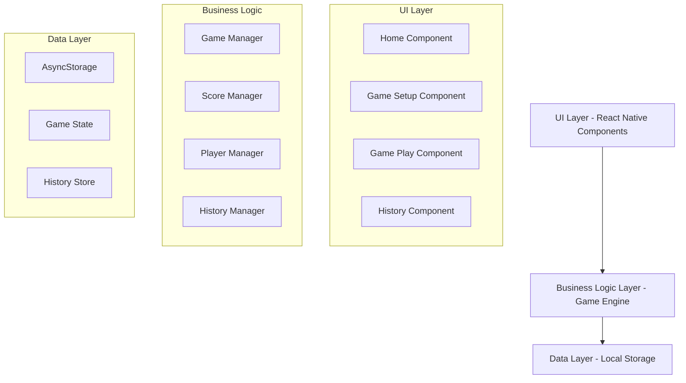

# Design Document

## Overview

Rummy Ledger is designed as a cross-platform mobile application using React Native to ensure consistent performance across iOS and Android devices. The architecture follows a modular, component-based approach with clear separation of concerns between UI components, business logic, and data persistence. The app emphasizes real-time score calculations, intuitive navigation, and responsive design principles.

## Architecture

### High-Level Architecture



### Technology Stack

- **Frontend Framework**: Expo with React Native and TypeScript for type safety
- **State Management**: React Context API with useReducer for game state
- **Local Storage**: Expo SecureStore and AsyncStorage for persisting game data and history
- **Navigation**: Expo Router with React Navigation for screen transitions
- **UI Components**: Custom components with Expo UI components as base
- **Animations**: React Native Reanimated (included in Expo) for smooth transitions
- **Haptic Feedback**: Expo Haptics for device feedback

## Components and Interfaces

### Core Components

#### 1. HomeScreen Component
- **Purpose**: Main entry point with navigation to new games and history
- **Props**: None
- **State**: Recent games summary
- **Key Features**:
  - Large "Create New Game" button
  - Quick access to game history
  - Recent players display

#### 2. GameSetupScreen Component
- **Purpose**: Player management and game configuration
- **Props**: Navigation object
- **State**: Players array, target score, recent players
- **Key Features**:
  - Dynamic player list (2-6 players)
  - Player name autocomplete from history
  - Target score input with validation
  - Start game validation

#### 3. GamePlayScreen Component
- **Purpose**: Main game interface with live scoring
- **Props**: Game configuration, navigation
- **State**: Current game state, round scores, leaderboard
- **Key Features**:
  - Real-time leaderboard display
  - Add round functionality
  - Score history access
  - Game end detection

#### 4. ScoreEntryModal Component
- **Purpose**: Round score input interface
- **Props**: Players array, onSubmit callback
- **State**: Round scores, validation errors
- **Key Features**:
  - Individual player score inputs
  - Rummy toggle buttons
  - Input validation
  - Haptic feedback on submission

#### 5. GameHistoryScreen Component
- **Purpose**: Display past games and detailed views
- **Props**: Navigation object
- **State**: Games history, selected game
- **Key Features**:
  - Chronological game list
  - Game detail modal
  - Search and filter capabilities

### Data Models

#### Game Model
```typescript
interface Game {
  id: string;
  players: Player[];
  rounds: Round[];
  targetScore?: number;
  status: 'active' | 'completed';
  winner?: string;
  createdAt: Date;
  completedAt?: Date;
}
```

#### Player Model
```typescript
interface Player {
  id: string;
  name: string;
  totalScore: number;
  isLeader: boolean;
}
```

#### Round Model
```typescript
interface Round {
  id: string;
  roundNumber: number;
  scores: PlayerScore[];
  timestamp: Date;
}

interface PlayerScore {
  playerId: string;
  score: number;
  isRummy: boolean;
}
```

### Service Interfaces

#### GameService
```typescript
interface GameService {
  createGame(players: string[], targetScore?: number): Game;
  addRound(gameId: string, scores: PlayerScore[]): Game;
  editRound(gameId: string, roundId: string, scores: PlayerScore[]): Game;
  deleteRound(gameId: string, roundId: string): Game;
  calculateLeaderboard(game: Game): Player[];
  checkGameEnd(game: Game): boolean;
}
```

#### StorageService
```typescript
interface StorageService {
  saveGame(game: Game): Promise<void>;
  loadGame(gameId: string): Promise<Game>;
  loadGameHistory(): Promise<Game[]>;
  savePlayerHistory(players: string[]): Promise<void>;
  loadRecentPlayers(): Promise<string[]>;
}
```

## Data Models

### Local Storage Schema

The app uses AsyncStorage with the following key structure:

- `@RummyLedger:currentGame` - Active game state
- `@RummyLedger:gameHistory` - Array of completed games
- `@RummyLedger:recentPlayers` - Recently used player names
- `@RummyLedger:settings` - User preferences (theme, haptics)

### State Management

#### Game Context
```typescript
interface GameContextType {
  currentGame: Game | null;
  gameHistory: Game[];
  recentPlayers: string[];
  createGame: (players: string[], targetScore?: number) => void;
  addRound: (scores: PlayerScore[]) => void;
  editRound: (roundId: string, scores: PlayerScore[]) => void;
  deleteRound: (roundId: string) => void;
  endGame: () => void;
}
```

## Error Handling

### Validation Errors
- **Player Management**: Minimum 2 players, maximum 6 players, unique names
- **Score Entry**: Non-negative integers only, all players must have scores
- **Target Score**: Positive integers only when specified

### Storage Errors
- **Save Failures**: Retry mechanism with user notification
- **Load Failures**: Graceful degradation with empty state
- **Corruption Recovery**: Data validation with fallback to defaults

### Network Independence
- **Offline First**: All functionality works without internet connection
- **Data Persistence**: Local storage ensures no data loss
- **Sync Considerations**: Future-ready for cloud sync implementation

## Testing Strategy

### Unit Testing
- **Components**: React Native Testing Library for component behavior
- **Services**: Jest for business logic and data operations
- **Models**: Validation and calculation testing
- **Coverage Target**: 90% code coverage

### Integration Testing
- **Game Flow**: End-to-end game creation to completion
- **Score Calculations**: Multi-round scoring accuracy
- **Data Persistence**: Storage and retrieval operations
- **Navigation**: Screen transitions and state preservation

### User Experience Testing
- **Performance**: 60fps animations and smooth scrolling
- **Accessibility**: Screen reader compatibility and touch targets
- **Device Testing**: Various screen sizes and orientations
- **Platform Testing**: iOS and Android feature parity

### Testing Tools
- **Unit Tests**: Jest with React Native Testing Library
- **E2E Tests**: Detox for automated user interaction testing
- **Performance**: Flipper for debugging and performance monitoring
- **Accessibility**: Built-in React Native accessibility testing

## UI/UX Design Specifications

### Design System
- **Color Palette**: 
  - Primary: Deep blue (#1E3A8A)
  - Secondary: Emerald green (#10B981)
  - Accent: Amber (#F59E0B)
  - Background: White/Dark gray based on theme
- **Typography**: System fonts with clear hierarchy
- **Spacing**: 8px grid system for consistent layouts
- **Animations**: 300ms duration for transitions

### Responsive Design
- **Screen Sizes**: Support for phones and tablets
- **Orientation**: Portrait primary, landscape support for tablets
- **Touch Targets**: Minimum 44px for accessibility
- **Safe Areas**: Proper handling of notches and home indicators

### Accessibility Features
- **Screen Reader**: Full VoiceOver/TalkBack support
- **High Contrast**: Enhanced visibility options
- **Font Scaling**: Dynamic type support
- **Motor Accessibility**: Large touch targets and gesture alternatives